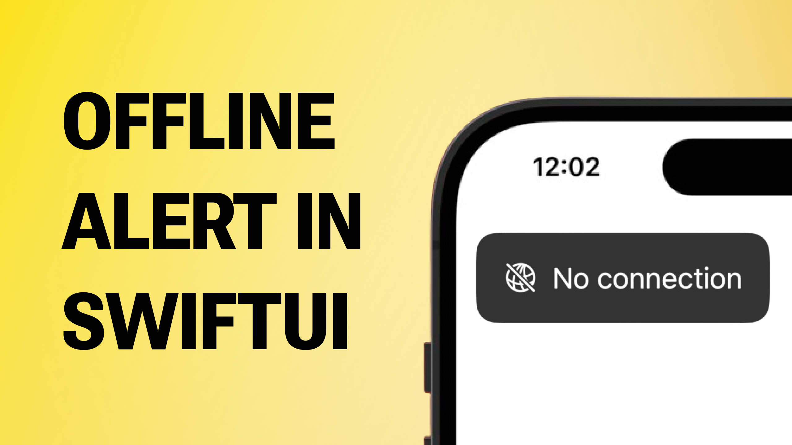

# How to Create an Offline Alert Using NWPathMonitor

This is the code from the YT video "How to Create an Offline Alert Using NWPathMonitor" 🤗

In this video, I will show you a step by step tutorial on how to create a simple, small, reusable network monitor component in SwiftUI. Enjoy 🤓

## Links:
- [Link to the video](https://www.youtube.com/watch?v=ieMv_TgIb04)
- [NWPathMonitor](https://developer.apple.com/documentation/network/nwpathmonitor)
- [Using the New Observation Framework to Network Monitoring in SwiftUI](https://holyswift.app/how-to-monitor-network-in-swiftui/)
